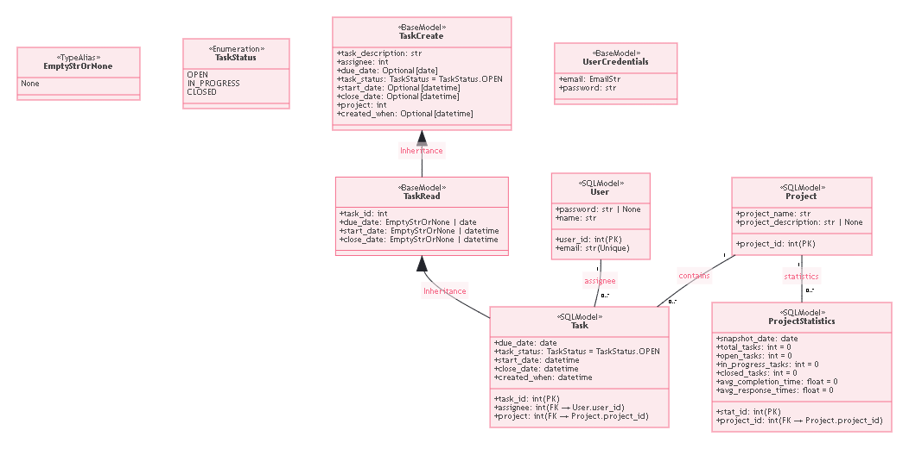

# Task manager

## Описанние

Проект по курсу "Программирование на Python". Сделан по мотивам примера с лекций: [исходник](https://github.com/LXDMIPT/fastapi-taskman).

В базе присутвуют 4 таблицы с реализованными CRUD-операциями. Основное нововведение - добавление методов для просмотра статистики проекта, для этого добавлена отдельная репортинговая таблица, хранящая снимки статистики проекта на конкретную дату и время. Также реализован метод позволяющий оценивать прогресс проекта за выбранный период времени.

```
Table Project {
    project_id int [primary key]
    project_name str
    project_description str
}

Table Task {
    task_id int [primary key]
    task_description str
    due_date date
    assignee int
    project int
    task_status TaskStatus
    start_date datetime
    close_date datetime
    created_when datetime
}

Table ProjectStatistics {
    stat_id int [primary key]
    project_id int
    snapshot_date date
    total_tasks int
    open_tasks int
    in_progress_tasks int
    closed_tasks int
    avg_completion_time float
    avg_response_times float
}

Table User {
    user_id int [primary key]
    email str [unique]
    password str
    name str
}

```

 

## Сборка

```bash
docker-compose up -d --build
```

## Тесты

```bash
docker exec task_manager-web-1 pytest --cov=app
```

## Pylint

```bash
docker exec task_manager-web-1 pylint .
```
